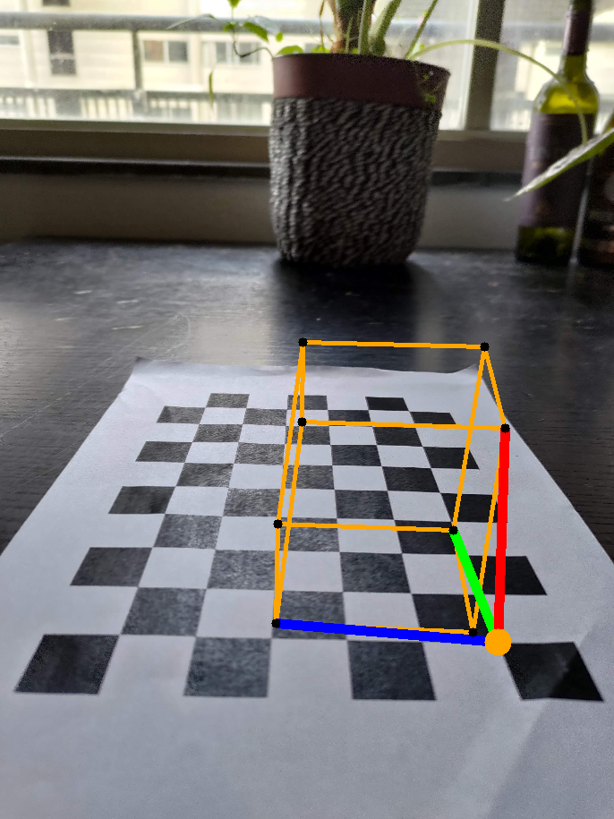
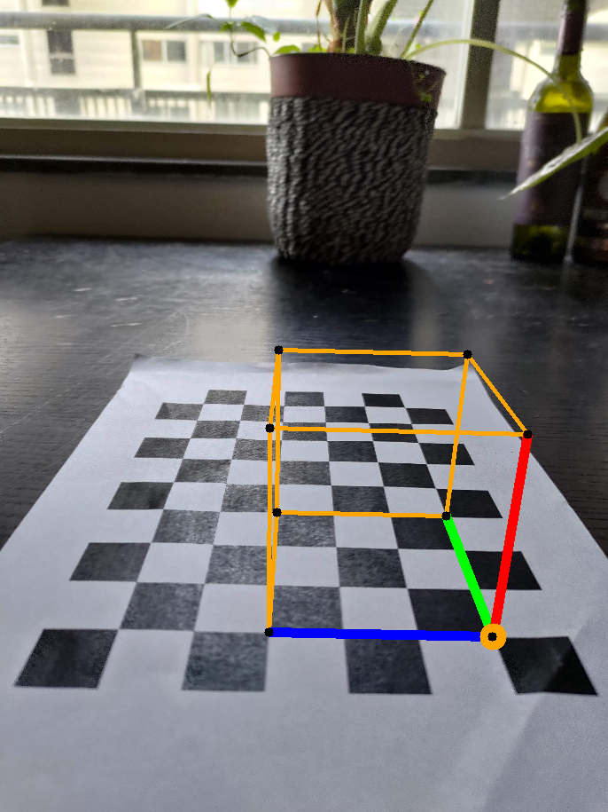

# ComputerVision

## Assignment 1

The offline phase of assignment 1 can be found in `./assignment1.py`. Both the annotation of data and the calibration of the camera happen in this script. You can choose the mode by changing the variable `calibration=True`. Additional parameters can be altered in this script. The images for the calibration can be found in the `./images/` folder. The images for run 2 are a subset of the images from run 1. Likewise, the images of run 3 are a subset of the images from run 2.

The online phase of assignment 1 can be found in `./assignment1_online_phase.py`. The undistorted images can be found in the folder `./images/cropped/`. The images with the axis and a cube drawn on them can be found in the folder `./images/cube/`.

To make a video and draw a cube in it, run the `assignment1_video.py` script.

